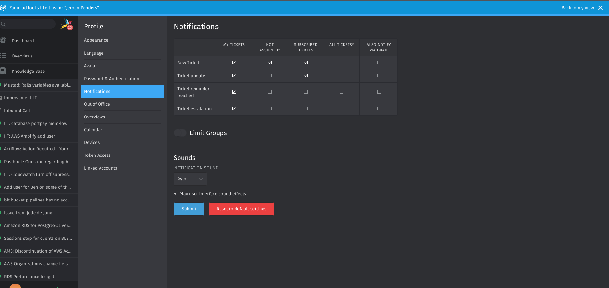

# brigit

**B**ranch **I**ntegrity **G**uard for **Git**



CLI tool for managing GitHub branch protection rules.

## Requirements

- `gh` - GitHub CLI (authenticated)
- `jq` - JSON processor
- `gum` - Terminal UI toolkit

## GitHub Permissions

### Required Permissions

To use brigit, you need appropriate GitHub permissions for the repositories and organizations you want to scan or enforce branch protection on.

#### For Scanning (`brigit scan`)

Your GitHub account must have:
- **Read access** to the repositories you want to scan
- **Organization member** role (for scanning all repos in an organization)
- Permission to view branch protection settings

#### For Enforcing (`brigit enforce`)

Your GitHub account must have:
- **Admin access** to the repositories you want to modify
- **Owner** or **Admin** role in the organization (for organization-wide operations)
- Permission to modify branch protection rules

### Authentication

Authenticate with GitHub CLI before using brigit:

```bash
# Login to GitHub
gh auth login

# Verify authentication and permissions
gh auth status

# Check your access to a specific organization
gh repo list your-organization --limit 5
```

### Common Permission Issues

**Error: "Repository not found or you don't have access"**
- You don't have read access to the repository
- The repository name or organization is incorrect
- Your GitHub token doesn't have the required scopes

**Error: "Resource not accessible by personal access token"**
- You need admin access to the repository to modify branch protection
- Upgrade your permissions or ask an organization owner for access

**Error: "Requires GitHub Pro for private repos"**
- Branch protection for private repositories requires GitHub Pro, Team, or Enterprise
- This is a GitHub limitation, not a brigit limitation

### Checking Your Permissions

Before running brigit, verify you have the correct permissions:

```bash
# List accessible repositories in an organization
gh repo list your-organization

# View your role in an organization
gh api /orgs/your-organization/memberships/$YOUR_USERNAME

# Test if you can view branch protection (requires admin access)
gh api /repos/your-organization/your-repo/branches/main/protection
```

### Best Practices

1. **Use a dedicated service account** for automated enforcement
2. **Limit scope** - Only grant necessary permissions
3. **Organization owners** should run brigit for organization-wide operations
4. **Test first** - Use `brigit scan` before using `brigit enforce`
5. **Review ignore list** - Ensure you don't accidentally modify critical repositories

## Installation

### Using Nix Flakes

```bash
# Run directly
nix run github:wearetechnative/brigit

# Install in your profile
nix profile add github:wearetechnative/brigit

# Use in a development shell
nix develop github:wearetechnative/brigit
```

### Manual Installation

```bash
# Clone the repository
git clone https://github.com/wearetechnative/brigit
cd brigit

# Make executable
chmod +x brigit

# Run
./brigit
```

## Usage

```bash
# Show help
brigit

# Scan repositories for branch protection compliance
brigit scan -o <organization>                    # All repos in org
brigit scan -o <organization> -r <repository>    # Specific repo
brigit scan -f repos.txt                         # Repos from file

# Enforce branch protection
brigit enforce -o <organization> -r <repository>  # Specific repo
brigit enforce -f repos-20260226_123456.txt       # From file

# Clean up log files
brigit clean                                      # Remove all log/repos files
```

## Workflow

```bash
# 1. Scan an organization
brigit scan -o my-org

# 2. Review results in brigit-scan-*.log

# 3. Enforce protection on repos with issues
brigit enforce -f repos-20260226_123456.txt

# 4. Verify everything is resolved
brigit scan -o my-org
```

## Output Files

| File | Description |
|------|-------------|
| `brigit-scan-yyyymmdd_hhmmss.log` | Scan results |
| `brigit-enforce-yyyymmdd_hhmmss.log` | Enforce results |
| `repos-yyyymmdd_hhmmss.txt` | Repos with issues (only created if issues exist) |

The `repos-*.txt` file contains repositories in `org:repo` format and can be used directly as input for `brigit enforce -f`.

## Configuration

### Branch Protection Settings

Branch protection settings are defined in `ghbranchprotection.json`. This file uses the [GitHub API branch protection format](https://docs.github.com/en/rest/branches/branch-protection).

#### Basic Example

```json
{
  "default": {
    "required_pull_request_reviews": {
      "required_approving_review_count": 1
    }
  }
}
```

#### Complete Example with All Options

```json
{
  "default": {
    "required_status_checks": {
      "strict": true,
      "contexts": ["ci/test", "ci/build"]
    },
    "enforce_admins": true,
    "required_pull_request_reviews": {
      "required_approving_review_count": 2,
      "dismiss_stale_reviews": true,
      "require_code_owner_reviews": true,
      "require_last_push_approval": false,
      "dismissal_restrictions": {
        "users": ["octocat"],
        "teams": ["justice-league"]
      }
    },
    "restrictions": {
      "users": ["octocat"],
      "teams": ["justice-league"],
      "apps": ["super-ci"]
    },
    "required_linear_history": false,
    "allow_force_pushes": false,
    "allow_deletions": false,
    "block_creations": false,
    "required_conversation_resolution": true,
    "lock_branch": false,
    "allow_fork_syncing": false
  }
}
```

#### Configuration Options

##### required_status_checks
Require status checks to pass before merging.

- `strict` (boolean): Require branches to be up to date before merging
- `contexts` (array): List of status checks that must pass (e.g., CI/CD job names)

```json
"required_status_checks": {
  "strict": true,
  "contexts": ["ci/test", "ci/lint", "security/scan"]
}
```

Set to `null` to disable status checks.

##### enforce_admins
- `true`: Enforce all restrictions for administrators
- `false`: Administrators can bypass restrictions

##### required_pull_request_reviews
Require pull request reviews before merging.

- `required_approving_review_count` (integer): Number of approvals required (1-6)
- `dismiss_stale_reviews` (boolean): Dismiss approvals when new commits are pushed
- `require_code_owner_reviews` (boolean): Require approval from code owners
- `require_last_push_approval` (boolean): Require approval on the last push
- `dismissal_restrictions` (object): Restrict who can dismiss reviews
  - `users` (array): GitHub usernames
  - `teams` (array): Team slugs

```json
"required_pull_request_reviews": {
  "required_approving_review_count": 2,
  "dismiss_stale_reviews": true,
  "require_code_owner_reviews": true
}
```

##### restrictions
Restrict who can push to the branch.

- `users` (array): GitHub usernames allowed to push
- `teams` (array): Team slugs allowed to push
- `apps` (array): GitHub App slugs allowed to push

```json
"restrictions": {
  "users": ["admin-user"],
  "teams": ["core-team"],
  "apps": ["dependabot"]
}
```

Set to `null` to allow all users with push access.

##### Additional Options

- `required_linear_history` (boolean): Prevent merge commits
- `allow_force_pushes` (boolean): Allow force pushes
- `allow_deletions` (boolean): Allow branch deletion
- `block_creations` (boolean): Block creation of matching branches
- `required_conversation_resolution` (boolean): Require all conversations to be resolved
- `lock_branch` (boolean): Make branch read-only
- `allow_fork_syncing` (boolean): Allow users to sync fork branches

#### Common Configurations

**Minimal Protection (1 approval)**
```json
{
  "default": {
    "required_pull_request_reviews": {
      "required_approving_review_count": 1
    }
  }
}
```

**Standard Protection (2 approvals + CI)**
```json
{
  "default": {
    "required_status_checks": {
      "strict": true,
      "contexts": ["ci/test"]
    },
    "required_pull_request_reviews": {
      "required_approving_review_count": 2,
      "dismiss_stale_reviews": true
    }
  }
}
```

**Strict Protection (code owners + admins)**
```json
{
  "default": {
    "enforce_admins": true,
    "required_pull_request_reviews": {
      "required_approving_review_count": 2,
      "dismiss_stale_reviews": true,
      "require_code_owner_reviews": true
    },
    "required_conversation_resolution": true
  }
}
```

For more information, see the [GitHub Branch Protection API documentation](https://docs.github.com/en/rest/branches/branch-protection).

### Ignore List

You can skip specific repositories by creating a `repos-ignore.txt` file:

```
# Format: org:repo (one per line)
# Lines starting with # are comments

technative-mcs:deprecated-repo
technative-mcs:test-repository
myorg:temporary-project
```

Repositories in the ignore list will be skipped during both `scan` and `enforce` operations and will show status `IGNORED`.

## Branch Protection Checks

brigit checks whether:
- Pull request is required for merging to main
- Minimum of 1 approval is required

## Repository Status

| Status | Description |
|--------|-------------|
| `OK` | Proper branch protection configured |
| `NOK` | Improper or missing branch protection |
| `ARCHIVED` | Repository is archived |
| `IGNORED` | Repository is in ignore list |
| `SKIPPED` | Repository skipped during enforcement |

## Examples

### Scan all repositories in an organization

```bash
brigit scan -o technative-mcs
```

### Scan specific repositories from a file

```bash
# Create repos.txt with:
# technative-mcs:repo1
# technative-mcs:repo2

brigit scan -f repos.txt
```

### Enforce protection on repositories with issues

```bash
# After scanning, use the generated repos-*.txt file
brigit enforce -f repos-20260226_123456.txt
```

### Using the ignore list

```bash
# Create repos-ignore.txt with repositories to skip
echo "technative-mcs:old-repo" >> repos-ignore.txt

# These repos will be marked as IGNORED
brigit scan -o technative-mcs
```

## Development

```bash
# Run in development mode
./brigit scan -o <organization>

# Run tests
nix flake check
```

## License

This project is licensed under the Apache License 2.0 - see the LICENSE file for details.
